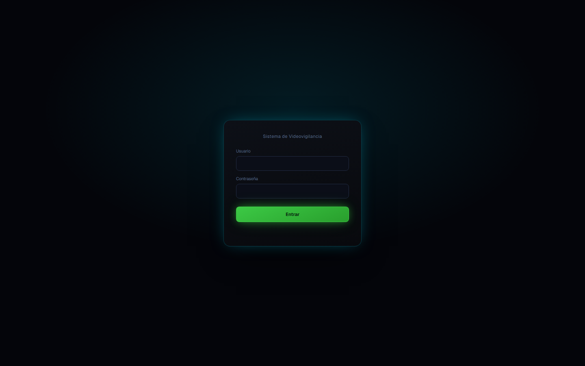
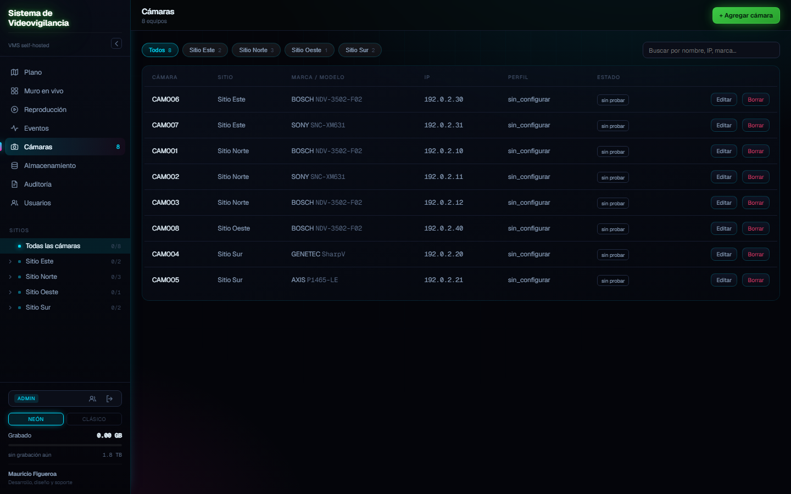
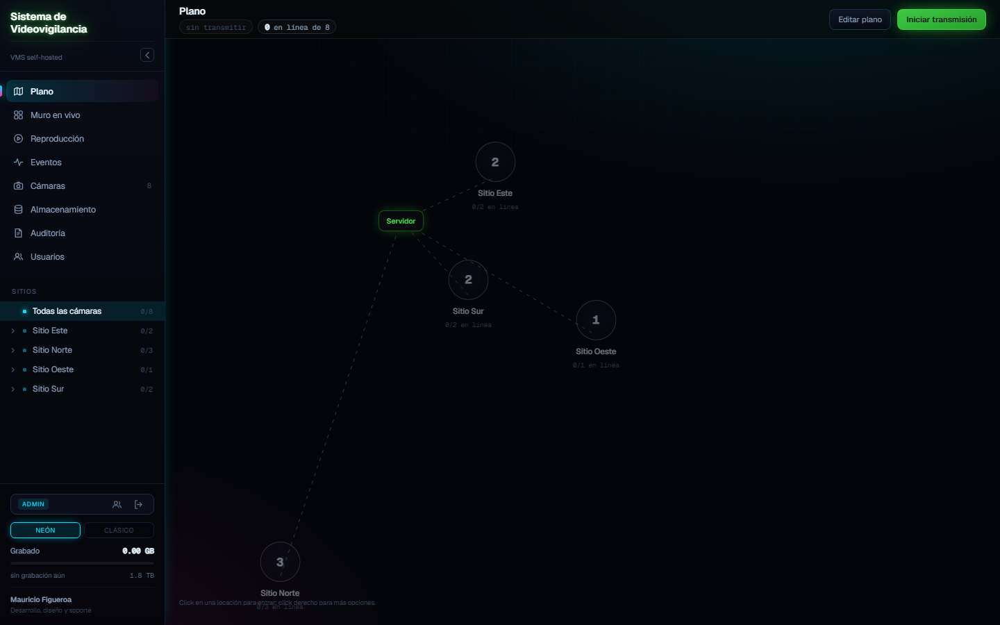
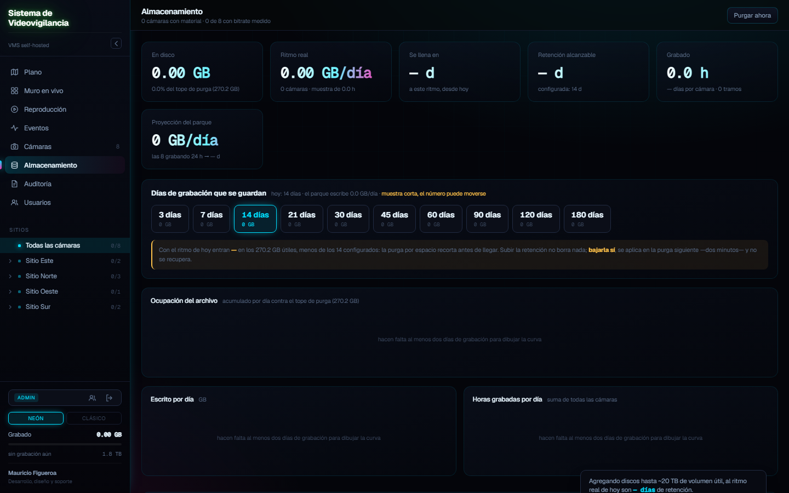
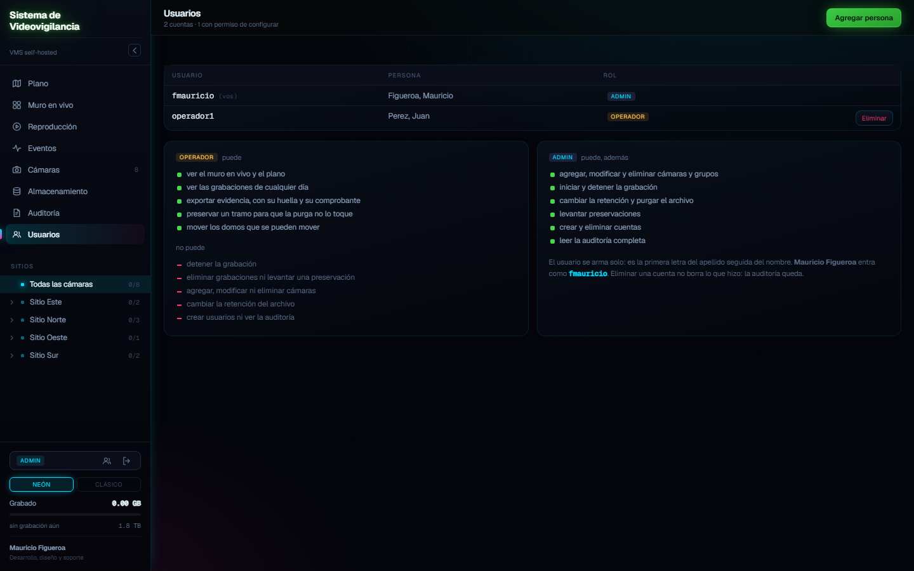
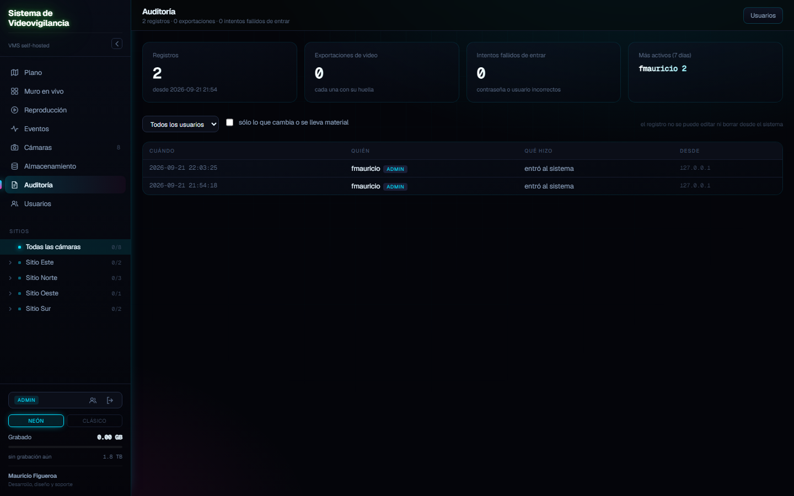

# Sistema de Videovigilancia

VMS (video management system) self-hosted, escrito desde cero para un parque
real de decenas de cámaras IP de varias marcas. Backend en Python puro
(FastAPI + SQLite + ffmpeg) y un frontend de una sola página, sin build ni
framework — pensado para correr en un único servidor Linux sin depender de
servicios en la nube.

No es una maqueta: corre en producción grabando 24/7, con la política de
retención, la purga y las funciones de rendición de cuentas (auditoría,
preservación de evidencia) que pide un cliente real.



## Funciones

- **Muro en vivo** (HLS) de todas las cámaras a la vez, con pantalla completa
  y HTTP/2 para no toparse con el límite de 6 conexiones por origen de
  HTTP/1.1 cuando hay muchos recuadros abiertos a la vez.
- **Grabación continua** por cámara, con purga automática según la retención
  configurada — calculada sobre el ritmo real de escritura, no una
  estimación.
- **Mando PTZ** por ONVIF, con freno del lado del servidor (si el navegador
  se cierra, el domo no sigue girando) y una foto de referencia mientras se
  mueve, porque el HLS llega varios segundos tarde para encuadrar a ciegas.
- **Plano en árbol**: grupos de cámaras anidados y arrastrables, independientes
  de los sitios del inventario — el laboratorio y el pack de ingreso pueden
  cruzar sitios sin problema.
- **Auditoría, preservar y exportar evidencia**: quién hizo qué (escrito desde
  el middleware, no desde cada ruta), marcar un rango para que la purga no lo
  toque, y exportar un MP4 con huella SHA-256 y comprobante.
- **Usuarios y roles** (operador / admin) aplicados en el backend, no sólo
  escondiendo botones en la interfaz.

<table>
<tr>
<td width="50%"></td>
<td width="50%"></td>
</tr>
<tr>
<td align="center"><sub>Alta y administración de cámaras</sub></td>
<td align="center"><sub>Plano en árbol, con grupos arrastrables</sub></td>
</tr>
<tr>
<td width="50%"></td>
<td width="50%"></td>
</tr>
<tr>
<td align="center"><sub>Retención y proyección de disco, sobre el ritmo real</sub></td>
<td align="center"><sub>Roles aplicados en el backend, documentados en la propia interfaz</sub></td>
</tr>
</table>

## Algunas decisiones de ingeniería

- **SQLite a propósito**, no por default: cero instalación adicional, corre
  igual en Windows y Linux, y el esquema es SQL estándar por si más adelante
  conviene mudarlo a PostgreSQL.
- **Las contraseñas de cámara se cifran con Fernet**; la llave vive fuera de
  la base y con permisos 0600 — una copia de la base sin la llave no sirve
  para leer credenciales.
- **La sesión es una cookie firmada con HMAC**, sin estado en el servidor:
  sobrevive a un reinicio del servicio sin desloguear a nadie.
- **La purga corre en tandas y sin el candado de escritura tomado**, para no
  colgar el resto del sistema con `database is locked` al bajar la
  retención de golpe.
- **El video lo sirve nginx directamente**, no Python — el backend sólo
  autoriza vía `auth_request`, cacheado, para no ser cuello de botella.
- **El grabador se reinicia si un proceso de ffmpeg queda vivo sin escribir
  bytes** (cámaras que entregan paquetes sin timestamps quedan colgadas sin
  que el sistema operativo lo note como un proceso caído).

## Instalación rápida (desarrollo)

```bash
cd backend
py -m pip install -r requirements.txt     # en Linux: python3 -m pip
py gestionar.py init                      # crea datos/sistema-videovigilancia.db
py gestionar.py importar                  # carga inventory/cameras.csv (trae datos de ejemplo)
py -m uvicorn app.main:app --reload       # API en http://localhost:8000/docs
py gestionar.py usuario admin admin       # primer usuario, pide la clave por teclado
```

Con eso ya se puede entrar a `web/index.html` y navegar la interfaz completa
con las 8 cámaras de ejemplo de `inventory/cameras.csv` (no apuntan a nada
real: sirven para probar la interfaz sin cámaras a mano).

```bash
py gestionar.py credencial bosch service   # pide la clave por teclado
py gestionar.py asignar bosch --marca BOSCH
py gestionar.py asignar sony --camara CAM001   # una sola: nombre, IP o id
```

Endpoints principales: `/api/salud`, `/api/camaras`, `/api/camaras/{id}`,
`/api/sitios`, `/api/almacenamiento`, `/api/grabador`, `/api/evidencia`,
`/api/preservaciones`, `/api/ptz`.

## Usuarios y roles

Dos roles:

- **operador**: mira el muro, el plano y la reproducción; arranca la
  transmisión; mueve domos por PTZ; exporta evidencia; preserva material de
  la purga. **No** detiene la grabación, no borra nada, no configura cámaras
  ni usuarios.
- **admin**: además edita el plano y los grupos, da de alta y baja cámaras,
  toca credenciales, detiene el grabador, purga a mano y crea usuarios.

La regla se aplica **en el backend** (`app/auth.py` + el middleware de
`main.py`): sin sesión ningún endpoint de datos responde; con sesión de
operador, cualquier acción fuera de la lista permitida devuelve 403. El
frontend además esconde los botones que no corresponden, pero eso es
comodidad, no seguridad.

```bash
py gestionar.py usuario NOMBRE operador   # o admin; pide la clave por teclado
py gestionar.py usuarios                  # listar
```

El usuario se arma solo a partir de nombre y apellido (primera letra del
apellido + nombre, sin tildes): "Juan Pérez" → `jperez`. No se elige a mano
para que la auditoría se lea sin consultar otra tabla.



Si la base no tiene ningún usuario, el sistema queda abierto (sin login) para
que un despliegue nuevo no se autobloquee. En cuanto se crea el primer
usuario, empieza a pedir sesión.

## Inventario de cámaras

`inventory/cameras.csv` es la fuente de verdad del alta masiva. Columnas
mínimas: `nombre`, `ip`, `sitio`, `ubicacion`, `ambiente`, `tipo`, `marca`,
`modelo`, `serie`, `mac`, `mascara`, `gateway`, `red`, `ptz`, `lpr`. Cargar
con `py gestionar.py importar`; una fila sin `nombre` o `ip` se descarta.

`tools/probe.py` sondea un rango CIDR o el inventario para completar marca y
modelo reales por ONVIF/RTSP sin escribir nada en las cámaras. `tools/vivas.py`
sólo revisa conectividad TCP, sin abrir sesión ONVIF ni RTSP, para poder
correrse las veces que haga falta sin consumir sesiones concurrentes.

Las claves de cámara van en `tools/credentials.json` (fuera del repositorio,
ver `.gitignore`) — usar `tools/credentials.example.json` como plantilla.

## Despliegue en un servidor Linux

```bash
scp -r . usuario@servidor:/tmp/sistema-videovigilancia
ssh usuario@servidor
sudo bash /tmp/sistema-videovigilancia/despliegue/instalar.sh
sudo SISTEMA_VIDEOVIGILANCIA_IP=<ip-del-servidor> bash /opt/sistema-videovigilancia/despliegue/nginx.sh
```

`instalar.sh` crea el usuario y grupo del sistema, instala el servicio
systemd (`despliegue/sistema-videovigilancia.service`) y deja el backend
corriendo en `127.0.0.1:8000`. `nginx.sh` pone nginx delante con TLS
(certificado autofirmado por IP, ya que suele ser una red interna sin
dominio público) y sirve `/media/` directamente para no pasar el video por
Python.

Variables de entorno relevantes (ver `backend/app/config.py`):
`SISTEMA_VIDEOVIGILANCIA_IP`, `SISTEMA_VIDEOVIGILANCIA_DATOS`, y las que fijan
rutas de base de datos, llave de cifrado y raíz de video.

Si el despliegue quiere mostrar un logo propio, basta con dejar un
`logo.png` en la raíz del proyecto — el login lo sirve si existe y lo oculta
si no.

## Estructura

```
backend/app/          API FastAPI, grabador, ONVIF/PTZ, auditoría, evidencia
backend/gestionar.py  CLI de administración (usuarios, credenciales, alta)
web/index.html        interfaz completa (muro, plano, PTZ, admin)
web/vendor/           dependencias de frontend vendorizadas (sin CDN)
despliegue/           systemd, nginx, instalador y script de subida
inventory/cameras.csv parque de ejemplo (fuente de verdad del alta)
tools/probe.py        sonda de relevamiento por ONVIF/RTSP
tools/vivas.py        chequeo liviano de conectividad
```

`datos/` (base, video grabado, llaves) y `tools/credentials.json` quedan
fuera del repositorio — ver `.gitignore`.

---

Desarrollo, diseño y despliegue: **Mauricio Figueroa**.
